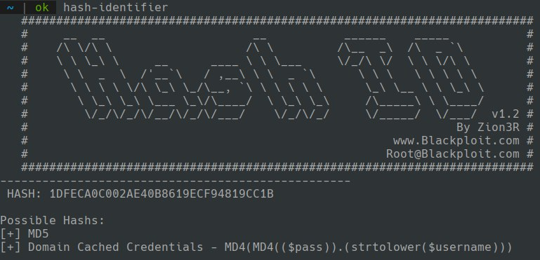
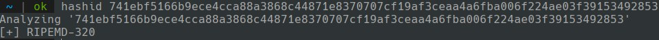

# hash-cracking

  La base consiste en aplicar fuerza bruta con una lista 
  de posibles contraseñas convirtiendo cada una de las 
  contraseñas de la lista en un hash y comparandolo con el 
  hash que tenemos.

## Identificado el tipo de hash
  Para poder identificar el tipo de hash 
  podemos utilizar herramientas tales como 
  hash-identifier :
 

  
  Hashid :

  Aunque si tiene caracteres especiales es mejor 
  identificarlos por la lista de hashes que tiene 
  hashcat en su documentacion :

