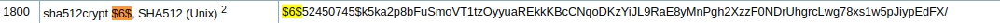

# hash-cracking

  La base consiste en aplicar fuerza bruta con una lista 
  de posibles contraseñas convirtiendo cada una de las 
  contraseñas de la lista en un hash y comparandolo con el 
  hash que tenemos.

## Identificando el tipo de hash
  Para poder identificar el tipo de hash 
  podemos utilizar herramientas tales como 
  hash-identifier :
 

  
  Hashid :


  Aunque si tiene caracteres especiales es mejor 
  identificarlos por la lista de hashes que tiene 
  hashcat en su documentacion :



## Wordlists 

Una vez tenemos el tipo de hash debemos definir que lista
de palabras usaremos contra el hash objetivo.
Una herramienta muy util para buscar y descargar wordlists
conocidas como rockyou.txt,dogs.txt,etc es : 

[wordlistcl](https://github.com/BlackArch/wordlistctl)

o podemos buscarlas manualmente por google.

## Herramientas de craqueo

### Hashcat 
  Es una herramienta bastante usada por la wiki que tiene todo 
  tipo de hashes.Un ejemplo de esto seria :


Una vez tenemos el modo de hash de la wiki podemos usar ese dato para atacar el
hash de esta manera :

```
hashcat -m 1800 hash.txt wordlist.txt
```

### John The Ripper

John the Ripper es otra herramienta con el mismo proposito 
pero es dependiente a un identificar de hashes ya que este no lo hace por
defecto con todos.
Por lo que una vez identifiquemos el tipo de hash con otrasherramientas
buscamos los formatos que contiene john the ripper para atacar los hashes de
esta manera :

```
john --list=formats
```
luego buscamos el formato con el nombre mas parecido al hash que busquemos
y atacamos el hash de esta manera.

```
john hash.txt --wordlist=wordlist.txt --format=md5crypt
```


